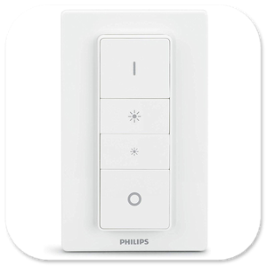
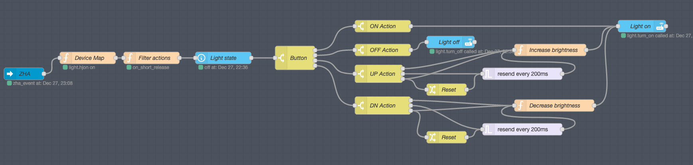
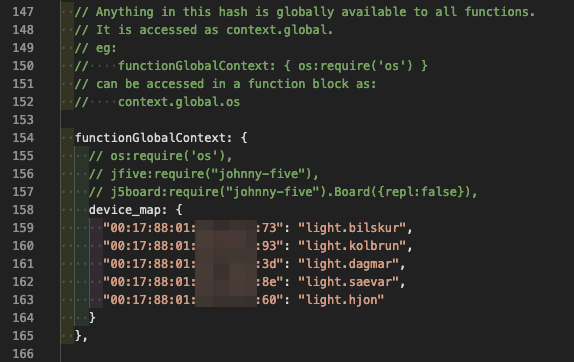
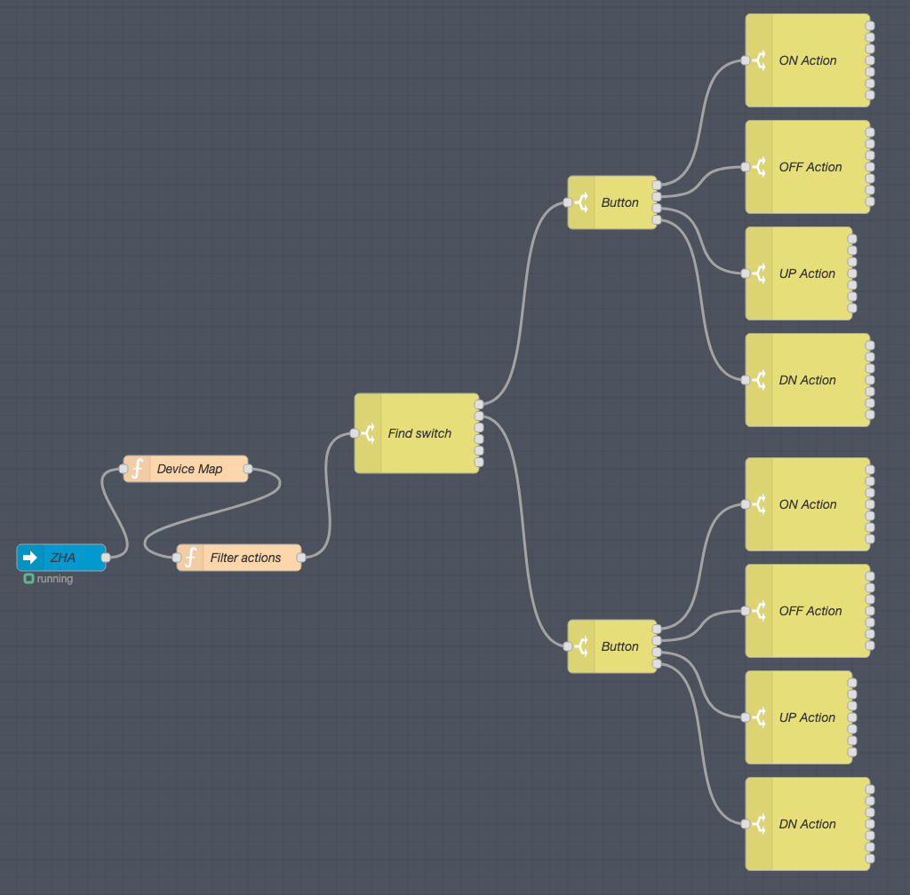

# Hue remote and ZHA

This article is about creating a [Node-Red](https://community.home-assistant.io/t/home-assistant-community-add-on-node-red/55023) flow that copies the default behaviour of the [Hue](https://www.philips-hue.com/en-us) Remote after connecting it to [Home Assistant](https://www.home-assistant.io/) using [ZHA](https://www.home-assistant.io/integrations/zha/). At the bottom is the flow you can import to Node-Red and also a base flow you can import if you want to use all actions available on the remote.



The 4 button Hue remote can be used to control your Hue lights, either by directly pairing it to a single light, or adding it to a Hue bridge and configuring it in the Hue app. By default you can turn the light on/off, increase/decrease brightness, and by pressing the on button while the light is on, you can cycle through 5 preset scenes.

If you decide to connect the remote directly to Home Assistant using ZHA, you need to manually configure every action you want to use. The remote does not expose entities for the buttons in Home Assistant, the only thing you get is the battery status. Instead you need to listen to ZHA events and create automations or Node-Red flows to handle them.

What I consider default functions:

- Turn light on/off
- Increase/decrease brightness

If you want to use other actions, you can import the actions flow base found at the bottom of this article and add functionality to it.

## Default flow



The device map is used to link the remote to a light entity in Home Assistant. I decided to add mine to the settings.js file in the node-red directory. You need to restart node-red every time you add a new entry to the map, but the map is available globally in node-red.

Device map is a key/value pair, where the key is device_ieee of the remote and value is the entity_id of the light you want to control with it. The value must start with "light." if you want the default functionality. If you want to manually configure the actions you want ot use, you can use any value. You can get the device_ieee of the remote by clicking Devices on the ZHA integration and clicking on the remote to get the details for it.



### Device map function

First, 'device_ieee' and 'command' are extracted from the event coming from the event listener node, and 'button' from event.args if it's present. Next, we get the name from the device map. If we get a name from the device map and the name begins with "light.", we set the node status to show a green dot with the name and button pressed, and update the payload with 'name', 'device_ieee', 'button' and 'command' to be used later in the flow.

If device_ieee is not present in the device map or if the name does not start with "light.", we do nothing.

``` javascript
const device_map = context.global.get('device_map')
const {device_ieee, command} = msg.payload.event;
const {button} = msg.payload.event.args || '';
const fill = 'green';
const shape = 'dot';
const name = device_map[device_ieee];
if (name && name.split('.')[0] === 'light') {
    const text = name + ' ' + button;
    node.status({fill, shape, text});
    return {...msg, payload: {name, device_ieee, button, command}};
}
return null
```

### Action filter function

Here we split the command to filter out actions we don't want to use. For every button press on the remote, there are at least two actions sent. To simplify later parts of the flow, only one action is sent for each type of button press.

Here's a list of the commands that come from the remote. They are prefixed with the button that was pressed. This example assumes the ON button was used:

- on_press
- on_short_release
- on_hold
- on_long_release
- on_double_press
- on_triple_press
- on_quadruple_press
- on_quintuple_press

For a single press, on_press and on_short_release are sent. They come in different order depending on how long the button was pressed. on_press is always filtered out.

For a hold the flow is: on_press -> on_hold -> on_hold -> ... -> on_long_release. Only the first hold action is sent and the long_release when the button is released.

For double, triple, quadruple and quintuple, one on_short_release is sent for each press and finally the actual action, for example on_double_press for double. on_short_release is filtered out.

The actions sent out of this node and used later are:

- short
- long
- hold
- double
- triple
- quadruple
- quintuple

``` javascript
context.last = context.last || null;
const [button, action] = msg.payload.command.split('_');
const setStatus = () => {
    node.status({fill: 'green', shape: 'dot', text: msg.payload.command});
}
if (button === 'step' || button === 'stop') {
    setStatus();
    // Some firmware versions send step and stop commands while holding
    // Ignoring them because we don't use them
    return null;
}
msg.payload.action = action;
switch (action) {
    case 'short' : {
        if (context.last === 'press') {
            context.last = null;
            setStatus()
            return msg;
        } else {
            context.last = action;
            return null;
        }
        break;
    }
    case 'press' : {
        if (context.last === 'short') {
            context.last = null;
            msg.payload.command = button + '_short_release';
            msg.payload.action = 'short';
            setStatus()
            return msg;
        } else {
            context.last = action;
            return null;
        }
        break;
    }
    case 'hold': {
        if (context.last === 'press') {
            context.last = action;
            setStatus();
            return msg;
        } else {
            return null;
        }
        break;
    }
    default : {
        context.last = null;
        setStatus()
        return msg;
    }
}
```

### Light state

The light state node gets the current state of the light. Current brightness is used as starting point in increase and decrease brightness functions.

### The switch nodes

The switch node labeled 'Button' figures out which of the 4 buttons was pressed. The following switch node figures out what action was used. For the default flow, only the 'short' action is used for on/off. For the up and down buttons, 'short', 'hold' and 'long' actions are used to increase/decrease brightness on the light.

### Brightness functions

Brightness can be any value between 1 and 255. Single press changes brightness by the value used in the 3rd last line (I use 5). If you hold the button, the loop is activated in the function node and the trigger node changes brightness every 200 milliseconds. When you release the button a reset message is sent to the trigger node to stop it and the function node stops the loop.

In the decrease function, if brightness goes below 1 it is set to 1 to prevent errors. Sending a greater value than 255 in the increase function does not cause an error so there is no need to check if the value is greater than 255.

``` javascript
context.status = context.status || null;
context.brightness = context.brightness || 0;
let fill = 'green';
let shape = 'dot';

const action = msg.payload.action;

const data = msg.data;
if (msg.payload.state === 'off') {
    // Light is off, do nothing
    return null;
}
if (!data || !data.attributes) {
    // Didn't get current state of light, do nothing
    return null;
}
if (!context.status) {
    // get and store current brightness
    context.brightness = data.attributes.brightness;
    if (action === 'hold') {
        // starting loop
        context.status = 'loop';
    }
}
if (context.status === 'loop') {
    fill = 'yellow';
}
if (action === 'long') {
    // ending loop
    context.status = null;
    fill = 'blue';
    node.status({fill, shape, text: context.brightness});
    return null;
}
context.brightness += 5
node.status({fill, shape, text: context.brightness})
return {...msg, payload: {data: {brightness: context.brightness}}}
```

### The flow

Here is the complete flow you can import into node-red

``` javascript
[{"id":"29ff1a5b.0b98f6","type":"server-events","z":"ebb20cb2.a4935","name":"ZHA","server":"6161853e.2c5a3c","event_type":"zha_event","exposeToHomeAssistant":false,"haConfig":[{"property":"name","value":""},{"property":"icon","value":""}],"waitForRunning":true,"x":70,"y":240,"wires":[["e943a5e8.60b278"]]},{"id":"e943a5e8.60b278","type":"function","z":"ebb20cb2.a4935","name":"Device Map","func":"const device_map = context.global.get('device_map')\nconst {device_ieee, command} = msg.payload.event;\nconst {button} = msg.payload.event.args || '';\nconst fill = 'green';\nconst shape = 'dot';\nconst name = device_map[device_ieee];\nif (name && name.split('.')[0] === 'light') {\n    const text = name + ' ' + button;\n    node.status({fill, shape, text});\n    return {...msg, payload: {name, device_ieee, button, command}};\n}\nreturn null","outputs":1,"noerr":0,"initialize":"","finalize":"","x":230,"y":200,"wires":[["33d064ba.b84404"]]},{"id":"7272149c.3d801c","type":"switch","z":"ebb20cb2.a4935","name":"Button","property":"payload.button","propertyType":"msg","rules":[{"t":"eq","v":"on","vt":"str"},{"t":"eq","v":"off","vt":"str"},{"t":"eq","v":"up","vt":"str"},{"t":"eq","v":"down","vt":"str"}],"checkall":"false","repair":false,"outputs":4,"x":750,"y":200,"wires":[["15fb1bb9.e5b00c"],["26f443ca.cd47bc"],["3509b0d5.89469"],["ab6c8846.5745c"]]},{"id":"c2b3107b.89193","type":"api-call-service","z":"ebb20cb2.a4935","name":"Light on","server":"6161853e.2c5a3c","version":1,"debugenabled":false,"service_domain":"light","service":"turn_on","entityId":"{{data.entity_id}}","data":"","dataType":"json","mergecontext":"","output_location":"","output_location_type":"none","mustacheAltTags":false,"x":1620,"y":120,"wires":[[]]},{"id":"8103612b.36b098","type":"api-call-service","z":"ebb20cb2.a4935","name":"Light off","server":"6161853e.2c5a3c","version":1,"debugenabled":false,"service_domain":"light","service":"turn_off","entityId":"{{data.entity_id}}","data":"","dataType":"json","mergecontext":"","output_location":"","output_location_type":"none","mustacheAltTags":false,"x":1140,"y":160,"wires":[[]]},{"id":"80b4f266.5084d8","type":"api-current-state","z":"ebb20cb2.a4935","name":"Light state","server":"6161853e.2c5a3c","version":1,"outputs":1,"halt_if":"","halt_if_type":"str","halt_if_compare":"is","override_topic":false,"entity_id":"{{payload.name}}","state_type":"str","state_location":"payload.state","override_payload":"msg","entity_location":"data","override_data":"msg","blockInputOverrides":false,"x":570,"y":200,"wires":[["7272149c.3d801c"]]},{"id":"33d064ba.b84404","type":"function","z":"ebb20cb2.a4935","name":"Filter actions","func":"context.last = context.last || null;\nconst [button, action] = msg.payload.command.split('_');\nconst setStatus = () => {\n    node.status({fill: 'green', shape: 'dot', text: msg.payload.command});\n}\nif (button === 'step' || button === 'stop') {\n    setStatus();\n    // Some firmware versions send step and stop commands while holding\n    // Ignoring them because we don't use them\n    return null;\n}\nmsg.payload.action = action;\nswitch (action) {\n    case 'short' : {\n        if (context.last === 'press') {\n            context.last = null;\n            setStatus()\n            return msg;\n        } else {\n            context.last = action;\n            return null;\n        }\n        break;\n    }\n    case 'press' : {\n        if (context.last === 'short') {\n            context.last = null;\n            msg.payload.command = button + '_short_release';\n            msg.payload.action = 'short';\n            setStatus()\n            return msg;\n        } else {\n            context.last = action;\n            return null;\n        }\n        break;\n    }\n    case 'hold': {\n        if (context.last === 'press') {\n            context.last = action;\n            setStatus();\n            return msg;\n        } else {\n            return null;\n        }\n        break;\n    }\n    default : {\n        context.last = null;\n        setStatus()\n        return msg;\n    }\n}\n","outputs":1,"noerr":0,"initialize":"","finalize":"","x":390,"y":200,"wires":[["80b4f266.5084d8"]]},{"id":"15fb1bb9.e5b00c","type":"switch","z":"ebb20cb2.a4935","name":"ON Action","property":"payload.action","propertyType":"msg","rules":[{"t":"eq","v":"short","vt":"str"}],"checkall":"false","repair":false,"outputs":1,"x":970,"y":120,"wires":[["c2b3107b.89193"]]},{"id":"26f443ca.cd47bc","type":"switch","z":"ebb20cb2.a4935","name":"OFF Action","property":"payload.action","propertyType":"msg","rules":[{"t":"eq","v":"short","vt":"str"}],"checkall":"false","repair":false,"outputs":1,"x":970,"y":180,"wires":[["8103612b.36b098"]]},{"id":"3509b0d5.89469","type":"switch","z":"ebb20cb2.a4935","name":"UP Action","property":"payload.action","propertyType":"msg","rules":[{"t":"eq","v":"short","vt":"str"},{"t":"eq","v":"hold","vt":"str"},{"t":"eq","v":"long","vt":"str"}],"checkall":"false","repair":false,"outputs":3,"x":960,"y":240,"wires":[["f61937f4.d70e2"],["ded64a72.fc2b48"],["977ec73d.5e3ff8","f61937f4.d70e2"]]},{"id":"ab6c8846.5745c","type":"switch","z":"ebb20cb2.a4935","name":"DN Action","property":"payload.action","propertyType":"msg","rules":[{"t":"eq","v":"short","vt":"str"},{"t":"eq","v":"hold","vt":"str"},{"t":"eq","v":"long","vt":"str"}],"checkall":"false","repair":false,"outputs":3,"x":970,"y":320,"wires":[["8971148.237e468"],["eac9f94d.563928"],["882ae4c5.77f07","8971148.237e468"]]},{"id":"ded64a72.fc2b48","type":"trigger","z":"ebb20cb2.a4935","name":"","op1":"","op2":"0","op1type":"pay","op2type":"str","duration":"-200","extend":false,"overrideDelay":false,"units":"ms","reset":"","bytopic":"all","topic":"topic","outputs":1,"x":1320,"y":240,"wires":[["f61937f4.d70e2"]]},{"id":"977ec73d.5e3ff8","type":"change","z":"ebb20cb2.a4935","name":"Reset","rules":[{"t":"set","p":"reset","pt":"msg","to":"true","tot":"bool"}],"action":"","property":"","from":"","to":"","reg":false,"x":1130,"y":280,"wires":[["ded64a72.fc2b48"]]},{"id":"f61937f4.d70e2","type":"function","z":"ebb20cb2.a4935","name":"Increase brightness","func":"context.status = context.status || null;\ncontext.brightness = context.brightness || 0;\nlet fill = 'green';\nlet shape = 'dot';\n\nconst action = msg.payload.action;\n\nconst data = msg.data;\nif (msg.payload.state === 'off') {\n    // Light is off, do nothing\n    return null;\n}\nif (!data || !data.attributes) {\n    // Didn't get current state of light, do nothing\n    return null;\n}\nif (!context.status) {\n    // get and store current brightness\n    context.brightness = data.attributes.brightness;\n    if (action === 'hold') {\n        // starting loop\n        context.status = 'loop';\n    }\n}\nif (context.status === 'loop') {\n    fill = 'yellow';\n}\nif (action === 'long') {\n    // ending loop\n    context.status = null;\n    fill = 'blue';\n    node.status({fill, shape, text: context.brightness});\n    return null;\n}\ncontext.brightness += 5\nnode.status({fill, shape, text: context.brightness})\nreturn {...msg, payload: {data: {brightness: context.brightness}}}","outputs":1,"noerr":0,"initialize":"","finalize":"","x":1390,"y":180,"wires":[["c2b3107b.89193"]]},{"id":"eac9f94d.563928","type":"trigger","z":"ebb20cb2.a4935","name":"","op1":"","op2":"0","op1type":"pay","op2type":"str","duration":"-200","extend":false,"overrideDelay":false,"units":"ms","reset":"","bytopic":"all","topic":"topic","outputs":1,"x":1320,"y":380,"wires":[["8971148.237e468"]]},{"id":"882ae4c5.77f07","type":"change","z":"ebb20cb2.a4935","name":"Reset","rules":[{"t":"set","p":"reset","pt":"msg","to":"true","tot":"bool"}],"action":"","property":"","from":"","to":"","reg":false,"x":1130,"y":400,"wires":[["eac9f94d.563928"]]},{"id":"8971148.237e468","type":"function","z":"ebb20cb2.a4935","name":"Decrease brightness","func":"context.status = context.status || null;\ncontext.brightness = context.brightness || 0;\nlet fill = 'green';\nlet shape = 'dot';\n\nconst action = msg.payload.action;\n\nconst data = msg.data;\nif (msg.payload.state === 'off') {\n    // Light is off, do nothing\n    return null;\n}\nif (!data || !data.attributes) {\n    // Didn't get current state of light, do nothing\n    return null;\n}\nif (!context.status) {\n    // get and store current brightness\n    context.brightness = data.attributes.brightness;\n    if (action === 'hold') {\n        // starting loop\n        context.status = 'loop';\n    }\n}\nif (context.status === 'loop') {\n    fill = 'yellow';\n}\nif (action === 'long') {\n    // ending loop\n    context.status = null;\n    fill = 'blue';\n    node.status({fill, shape, text: context.brightness});\n    return null;\n}\ncontext.brightness -= 5\nif (context.brightness < 1) {\n    context.brightness = 1;\n}\nnode.status({fill, shape, text: context.brightness})\nreturn {...msg, payload: {data: {brightness: context.brightness}}}\n","outputs":1,"noerr":0,"initialize":"","finalize":"","x":1400,"y":320,"wires":[["c2b3107b.89193"]]},{"id":"6161853e.2c5a3c","type":"server","name":"Home Assistant","legacy":false,"addon":true,"rejectUnauthorizedCerts":true,"ha_boolean":"y|yes|true|on|home|open","connectionDelay":false,"cacheJson":true}]
```

## Actions flow base



The Find switch node is used to identify what Hue remote the action came from. For each remote you want to configure actions for you need to copy all 5 switch nodes that come after the Find switch node.

Here is the flow you can import into node-red

``` javascript
[{"id":"8905092a.959398","type":"switch","z":"ebb20cb2.a4935","name":"Button","property":"payload.button","propertyType":"msg","rules":[{"t":"eq","v":"on","vt":"str"},{"t":"eq","v":"off","vt":"str"},{"t":"eq","v":"up","vt":"str"},{"t":"eq","v":"down","vt":"str"}],"checkall":"false","repair":false,"outputs":4,"x":750,"y":800,"wires":[["5e8214d.4ddd8ec"],["15c440fe.7e41d7"],["971f840d.17bce"],["22e9856.af9157a"]]},{"id":"5e8214d.4ddd8ec","type":"switch","z":"ebb20cb2.a4935","name":"ON Action","property":"payload.action","propertyType":"msg","rules":[{"t":"eq","v":"short","vt":"str"},{"t":"eq","v":"hold","vt":"str"},{"t":"eq","v":"long","vt":"str"},{"t":"eq","v":"double","vt":"str"},{"t":"eq","v":"triple","vt":"str"},{"t":"eq","v":"quadruple","vt":"str"},{"t":"eq","v":"quintuple","vt":"str"}],"checkall":"false","repair":false,"outputs":7,"x":970,"y":640,"wires":[[],[],[],[],[],[],[]]},{"id":"15c440fe.7e41d7","type":"switch","z":"ebb20cb2.a4935","name":"OFF Action","property":"payload.action","propertyType":"msg","rules":[{"t":"eq","v":"short","vt":"str"},{"t":"eq","v":"hold","vt":"str"},{"t":"eq","v":"long","vt":"str"},{"t":"eq","v":"double","vt":"str"},{"t":"eq","v":"triple","vt":"str"},{"t":"eq","v":"quadruple","vt":"str"},{"t":"eq","v":"quintuple","vt":"str"}],"checkall":"false","repair":false,"outputs":7,"x":970,"y":760,"wires":[[],[],[],[],[],[],[]]},{"id":"971f840d.17bce","type":"switch","z":"ebb20cb2.a4935","name":"UP Action","property":"payload.action","propertyType":"msg","rules":[{"t":"eq","v":"short","vt":"str"},{"t":"eq","v":"hold","vt":"str"},{"t":"eq","v":"long","vt":"str"},{"t":"eq","v":"double","vt":"str"},{"t":"eq","v":"triple","vt":"str"},{"t":"eq","v":"quadruple","vt":"str"},{"t":"eq","v":"quintuple","vt":"str"}],"checkall":"false","repair":false,"outputs":7,"x":960,"y":880,"wires":[[],[],[],[],[],[],[]]},{"id":"22e9856.af9157a","type":"switch","z":"ebb20cb2.a4935","name":"DN Action","property":"payload.action","propertyType":"msg","rules":[{"t":"eq","v":"short","vt":"str"},{"t":"eq","v":"hold","vt":"str"},{"t":"eq","v":"long","vt":"str"},{"t":"eq","v":"double","vt":"str"},{"t":"eq","v":"triple","vt":"str"},{"t":"eq","v":"quadruple","vt":"str"},{"t":"eq","v":"quintuple","vt":"str"}],"checkall":"false","repair":false,"outputs":7,"x":970,"y":1000,"wires":[[],[],[],[],[],[],[]]},{"id":"724dc28f.046214","type":"server-events","z":"ebb20cb2.a4935","name":"ZHA","server":"6161853e.2c5a3c","event_type":"zha_event","exposeToHomeAssistant":false,"haConfig":[{"property":"name","value":""},{"property":"icon","value":""}],"waitForRunning":true,"x":130,"y":1200,"wires":[["50a33888.71955"]]},{"id":"50a33888.71955","type":"function","z":"ebb20cb2.a4935","name":"Device Map","func":"const device_map = context.global.get('device_map')\nconst {device_ieee, command} = msg.payload.event;\nconst {button} = msg.payload.event.args || '';\nconst fill = 'green';\nconst shape = 'dot';\nconst name = device_map[device_ieee]\nif (name) {\n    const text = name + ' ' + button;\n    node.status({fill, shape, text})\n    return {...msg, payload: {name, device_ieee, button, command}};\n}\nreturn null","outputs":1,"noerr":0,"initialize":"","finalize":"","x":270,"y":1100,"wires":[["6f16ac96.67ca3c"]]},{"id":"6a0f76a.d858908","type":"switch","z":"ebb20cb2.a4935","name":"Find switch","property":"payload.name","propertyType":"msg","rules":[{"t":"eq","v":"light.bilskur","vt":"str"},{"t":"eq","v":"light.kolbrun","vt":"str"},{"t":"eq","v":"light.dagmar","vt":"str"},{"t":"eq","v":"light.saevar","vt":"str"},{"t":"eq","v":"light.hjon","vt":"str"},{"t":"eq","v":"other","vt":"str"}],"checkall":"true","repair":false,"outputs":6,"x":530,"y":1060,"wires":[["8905092a.959398"],["6dda9e93.c3fa58"],[],[],[],[]]},{"id":"6f16ac96.67ca3c","type":"function","z":"ebb20cb2.a4935","name":"Filter actions","func":"context.last = context.last || null;\nconst [button, action] = msg.payload.command.split('_');\nconst setStatus = () => {\n    node.status({fill: 'green', shape: 'dot', text: msg.payload.command});\n}\nif (button === 'step' || button === 'stop') {\n    setStatus();\n    // Some firmware versions send step and stop commands while holding\n    // Ignoring them because we don't use them\n    return null;\n}\nmsg.payload.action = action;\nswitch (action) {\n    case 'short' : {\n        if (context.last === 'press') {\n            context.last = null;\n            setStatus()\n            return msg;\n        } else {\n            context.last = action;\n            return null;\n        }\n        break;\n    }\n    case 'press' : {\n        if (context.last === 'short') {\n            context.last = null;\n            msg.payload.command = button + '_short_release';\n            msg.payload.action = 'short';\n            setStatus()\n            return msg;\n        } else {\n            context.last = action;\n            return null;\n        }\n        break;\n    }\n    case 'hold': {\n        if (context.last === 'press') {\n            context.last = action;\n            setStatus();\n            return msg;\n        } else {\n            return null;\n        }\n        break;\n    }\n    default : {\n        context.last = null;\n        setStatus()\n        return msg;\n    }\n}\n","outputs":1,"noerr":0,"initialize":"","finalize":"","x":330,"y":1200,"wires":[["6a0f76a.d858908"]]},{"id":"6dda9e93.c3fa58","type":"switch","z":"ebb20cb2.a4935","name":"Button","property":"payload.button","propertyType":"msg","rules":[{"t":"eq","v":"on","vt":"str"},{"t":"eq","v":"off","vt":"str"},{"t":"eq","v":"up","vt":"str"},{"t":"eq","v":"down","vt":"str"}],"checkall":"false","repair":false,"outputs":4,"x":750,"y":1300,"wires":[["f93916d3.dcbb8"],["54bb371d.47556"],["f43afa09.cbe24"],["1b5780ea.d9c177"]]},{"id":"f93916d3.dcbb8","type":"switch","z":"ebb20cb2.a4935","name":"ON Action","property":"payload.action","propertyType":"msg","rules":[{"t":"eq","v":"short","vt":"str"},{"t":"eq","v":"hold","vt":"str"},{"t":"eq","v":"long","vt":"str"},{"t":"eq","v":"double","vt":"str"},{"t":"eq","v":"triple","vt":"str"},{"t":"eq","v":"quadruple","vt":"str"},{"t":"eq","v":"quintuple","vt":"str"}],"checkall":"false","repair":false,"outputs":7,"x":970,"y":1140,"wires":[[],[],[],[],[],[],[]]},{"id":"54bb371d.47556","type":"switch","z":"ebb20cb2.a4935","name":"OFF Action","property":"payload.action","propertyType":"msg","rules":[{"t":"eq","v":"short","vt":"str"},{"t":"eq","v":"hold","vt":"str"},{"t":"eq","v":"long","vt":"str"},{"t":"eq","v":"double","vt":"str"},{"t":"eq","v":"triple","vt":"str"},{"t":"eq","v":"quadruple","vt":"str"},{"t":"eq","v":"quintuple","vt":"str"}],"checkall":"false","repair":false,"outputs":7,"x":970,"y":1260,"wires":[[],[],[],[],[],[],[]]},{"id":"f43afa09.cbe24","type":"switch","z":"ebb20cb2.a4935","name":"UP Action","property":"payload.action","propertyType":"msg","rules":[{"t":"eq","v":"short","vt":"str"},{"t":"eq","v":"hold","vt":"str"},{"t":"eq","v":"long","vt":"str"},{"t":"eq","v":"double","vt":"str"},{"t":"eq","v":"triple","vt":"str"},{"t":"eq","v":"quadruple","vt":"str"},{"t":"eq","v":"quintuple","vt":"str"}],"checkall":"false","repair":false,"outputs":7,"x":960,"y":1380,"wires":[[],[],[],[],[],[],[]]},{"id":"1b5780ea.d9c177","type":"switch","z":"ebb20cb2.a4935","name":"DN Action","property":"payload.action","propertyType":"msg","rules":[{"t":"eq","v":"short","vt":"str"},{"t":"eq","v":"hold","vt":"str"},{"t":"eq","v":"long","vt":"str"},{"t":"eq","v":"double","vt":"str"},{"t":"eq","v":"triple","vt":"str"},{"t":"eq","v":"quadruple","vt":"str"},{"t":"eq","v":"quintuple","vt":"str"}],"checkall":"false","repair":false,"outputs":7,"x":970,"y":1500,"wires":[[],[],[],[],[],[],[]]},{"id":"6161853e.2c5a3c","type":"server","name":"Home Assistant","legacy":false,"addon":true,"rejectUnauthorizedCerts":true,"ha_boolean":"y|yes|true|on|home|open","connectionDelay":false,"cacheJson":true}]
```
